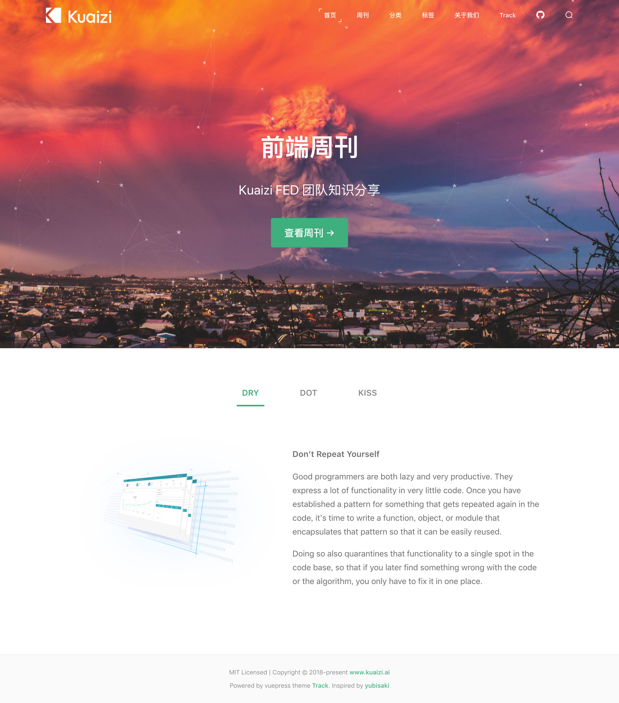
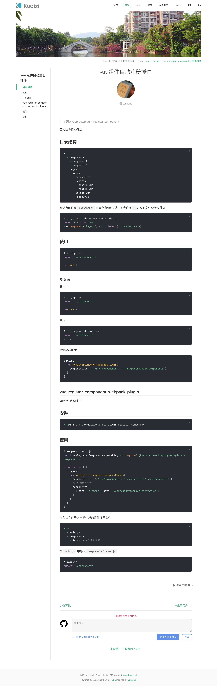

# vuepress-theme-track

* [true-track](https://www.ui.cn/detail/120714.html)
* [vuepress-theme-yubisaki](https://github.com/Yubisaki/vuepress-theme-yubisaki)




[more screenshot](./screenshot/home.jpg)

[Live Demo](https://kuaizi-co.github.io/blog/track.html)

## USAGE

```
$ yarn add vuepress-theme-track
# or
$ npm install vuepress-theme-track --save-dev
```
### Configuration

In your `docs/.vuepress/config.js` file, It's to add this:

```
module.exports = {
  title: '前端周刊',
  description: '每周分享前端知识',
  base: '/blog/',
  head: [
    ['link', { rel: 'icon', href: 'favicon.ico' }]
  ],
  // use vuepress-theme-track
  theme: 'track',
  // local development
  port: 3000,
  // Google Analytics ID
  ga: '',
  // fuck IE
  evergreen: true,
  markdown: {
    // markdown-it-anchor 的选项
    anchor: { permalink: true },
    // markdown-it-toc 的选项
    toc: { includeLevel: [1, 2] },
    config: md => {
      md.use(require('markdown-it-task-lists')) // 一个 checkbox 的 TODO List 插件
        .use(require('markdown-it-imsize'), { autofill: true }) // 支持自定义 md 图片大小 
    }
  },
  themeConfig: {
    footer: 'MIT Licensed | Copyright © 2018-present tommyshao',
    // github card
    // github account name
    github: 'tomieric',
    // logo
    logo: '/images/logo.png',
    // homepage logo
    logoInverse: '/images/logo-white.png',
    // It's show font color to post title
    accentColor: '#ac3e40',
    // pageSize
    per_page: 5,
    // date format
    date_format: 'yyyy-MM-dd',
    // Tag
    tags: true,
    // gitalk
    // https://github.com/Yubisaki/vuepress-theme-yubisaki#comment-system
    comment: {
      clientID: '',
      clientSecret: '',
      repo: 'https://github.com/tomieric/vuepress-theme-track.git',
      owner: 'tomieric',
      admin: ['tomieric'],
      perPage: 5,
      // id: 'comment',      // Ensure uniqueness and length less than 50
      distractionFreeMode: false  // Facebook-like distraction free mode
    },
    // navLinks
    nav: [
        { text: '首页', link: '/'}, // home
        { text: '周刊', link: '/weekly/'}, // blog
        { text: '分类', link: '/category/' }, // category
        { text: '标签', link: '/tag/' }, // tag
        { text: '关于我们', link: '/about' },
        { text: 'Track', link: '/track' }
    ],
    // page list home url
    pageRoot: '/weekly/',
    sidebar: 'auto',
    // show author in post article, Default: false
    // Team blog, show everyone in memenbers
    showAuthor: true
  }
}
```

### Scripts

In your `package.json` file

```
# package.json
{
  "scripts": {
    "docs:dev": "vuepress dev docs",
    "docs:build": "vuepress build docs",
    "docs:deploy": "gh-pages -d ./vuepress/dist"
  }
}
```

### CommandLine

we're support to the `vp-track` command,It's usually use to create a new post

```
$ npx vp-track --help
# -p post
# -d destination
$ npx vp-track -p test -d docs/weekly
> ✔ Create test succeeded!
```